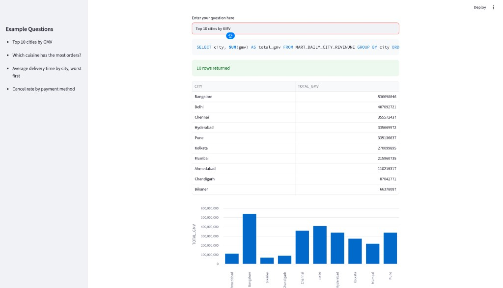
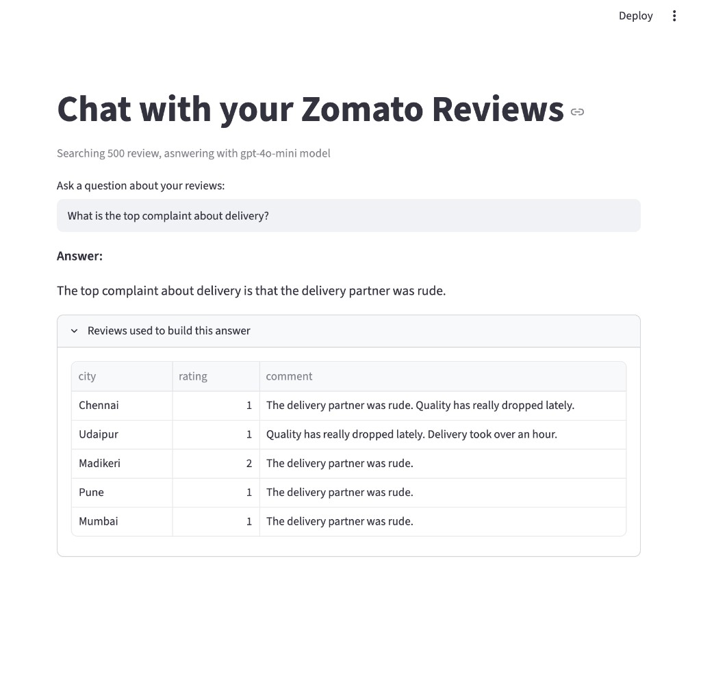

# Zomato Data Pipeline

A daily batch pipeline for a food-delivery dataset. CSV files land in S3, Snowflake loads them, dbt builds the warehouse tables, and a small OpenAI step tags review sentiment. Two Streamlit apps sit on top of the finished tables: one turns a question into SQL, the other searches reviews and answers from the ones it found.

The point was to go from raw files to something you can actually ask a question of, and to keep the warehouse work in the middle instead of skipping straight to a chatbot.

## Apps

**Text to SQL.** You type something like "top 10 cities by GMV". `gpt-4o-mini` writes one `SELECT`, Snowflake runs it against the marts, and a two-column numeric result gets a bar chart.



**Review search.** The app embeds a sample of review comments, finds the closest ones to your question, and asks the model to answer using only those. The reviews it used are listed under the answer.



## What the daily job does

The Airflow DAG `zomato_batch` runs once a day. The tasks are wired in this order:

`reload_raw` → `dbt_build_core` → `enrich_reviews` → `dbt_build_ai`

1. **Reload raw.** `COPY INTO` from the S3 stage into `ZOMATO.RAW` (restaurants, users, food, menu, orders, order items, reviews).
2. **dbt build (core).** Staging views and marts. Anything tagged `ai` is skipped here, because those models need the enrichment table first.
3. **Enrich reviews.** `ai/enrich_reviews.py` sends new review comments to `gpt-4o-mini` and writes sentiment, topic, and a short key issue into `ZOMATO.AI.REVIEW_ENRICHED`.
4. **dbt build (ai).** Builds `mart_review_insights`, which joins those labels back to the staged reviews.

Staging models are views. Marts are tables. `fct_orders` is incremental (merge on `order_id`), so later runs only pick up newer orders.

## Stack

- **Snowflake** for the warehouse (`ZOMATO_WH`, database `ZOMATO`)
- **dbt** (`dbt-snowflake`) for staging, tests, and marts
- **Apache Airflow 3** in Docker (LocalExecutor, Postgres metadata DB) to schedule the batch
- **AWS S3** through a Snowflake storage integration and external stage
- **OpenAI** — `gpt-4o-mini` for classification and text-to-SQL, `text-embedding-3-small` for review search
- **Streamlit** for the two chat apps
- **Python 3.12** and **uv** for the local package

## Repo layout

```
zomato_data_pipeline/
├── airflow/
│   ├── dags/zomato_batch.py    # the daily DAG
│   ├── docker-compose.yaml
│   └── Dockerfile              # Airflow 3 + Snowflake provider + dbt venv
├── ai/
│   ├── enrich_reviews.py       # batch sentiment / topic tagging
│   ├── text_to_sql.py          # Streamlit: question -> SELECT
│   └── rag_chat.py             # Streamlit: search reviews, then answer
├── snowflake/                  # one-time setup, run in order
│   ├── 01_setup.sql
│   ├── 02_storage_integration.sql
│   ├── 03_stage_and_formats.sql
│   ├── 04_raw_tables.sql
│   └── 05_copy_into.sql
├── zomato/                     # dbt project
│   ├── models/staging/         # cleaned views + source YAML + tests
│   └── models/marts/           # dims, facts, summary tables
├── docs/                       # screenshots used in this README
└── src/zomato_data_pipeline/   # package entry point
```

## Models

**Staging** reads `ZOMATO.RAW` through `source('raw', ...)` and cleans names and types: `stg_orders`, `stg_order_items`, `stg_restaurants`, `stg_users`, `stg_food`, `stg_menu`, `stg_reviews`. Tests in `_staging.yml` check unique keys and nulls on the important ids.

**Marts**

| Model | What you get |
| --- | --- |
| `dim_customer` | Customers, plus an age band (Gen Z, Millennial, Gen X, Boomer) |
| `dim_restaurants` | Restaurant attributes |
| `dim_food` / `dim_date` | Food items and a date dimension |
| `fct_orders` | One row per order. Incremental merge. |
| `fact_order_items` | Line items |
| `mart_restaurant_performance` | Orders, revenue, rating, and delivery time per restaurant |
| `mart_daily_city_revenune` | Daily orders, cancel rate, GMV, and AOV by city |
| `mart_delivery_sla` | Median and p90 delivery time by city and hour |
| `mart_review_insights` | Review counts and average sentiment by city, topic, and label. Tagged `ai`. |

## The AI pieces

**`enrich_reviews.py`** only classifies reviews that are not already in `ZOMATO.AI.REVIEW_ENRICHED`. Batch size is `SAMPLE_N` (default 5). `classify_review()` asks for JSON: `sentiment_label`, `sentiment_score` (-1 to 1), `topic` (food quality, delivery, pricing, service, packaging, or other), and `key_issue`. A bad response is skipped so the rest of the batch still saves.

**`text_to_sql.py`** is the first screenshot. `generate_sql()` sends the question plus a short schema prompt and expects `{"sql": "..."}`. `is_safe()` checks that the query starts with `SELECT` or `WITH`, and rejects words like `drop`, `delete`, `update`, and `insert` before anything is sent to the warehouse. `run_query()` runs it in `STAGING_MARTS` and returns a dataframe. Example questions are in the sidebar: top cities by GMV, busiest cuisine, slowest cities, cancel rate by payment method.

**`rag_chat.py`** pulls 500 staged reviews, embeds the comments with `text-embedding-3-small`, and caches them in `review_embeddings.parquet` so Snowflake and the embedding call only happen the first time. `find_similar_reviews()` embeds the question, scores each review with cosine similarity, and keeps the top 5. `ask_llm()` is told to answer only from those reviews. If they don't cover the question, it should say so. The expander under the answer is that top-5 table.

## Setup

You need a Snowflake account, an S3 bucket Snowflake can read, and an OpenAI API key.

**1. Warehouse (run the SQL files in `snowflake/` as `ACCOUNTADMIN`, in order)**

Edit `02_storage_integration.sql` and `03_stage_and_formats.sql` and replace `<ROLE_ARN>` and `<BUCKET>` with your IAM role and bucket. After creating the integration, run `DESC INTEGRATION ZOMATO_S3_INT` and put the IAM user ARN and external ID on the role's trust policy. `05_copy_into.sql` is the manual first load and includes a row-count check.

**2. Environment**

Airflow and the Python scripts read these. Put them in a `.env` file (it is gitignored) or export them in the shell. Do not commit `zomato/profiles.yml` with real passwords in it.

```
SNOWFLAKE_ACCOUNT
SNOWFLAKE_USER
SNOWFLAKE_PASSWORD
SNOWFLAKE_WAREHOUSE=ZOMATO_WH
SNOWFLAKE_DATABASE=ZOMATO
SNOWFLAKE_SCHEMA=RAW
OPENAI_API_KEY
SAMPLE_N=5
```

dbt uses `zomato/profiles.yml` (target `dev`, role `DBT_ROLE`). Point `account`, `user`, and `password` at your own account.

**3. Airflow**

```bash
cd airflow
docker compose up --build
```

UI is at [http://localhost:8080](http://localhost:8080). The init container creates `admin` / `admin`. The compose file mounts `dags/`, the dbt project, and `ai/` into the containers. dbt itself lives in `/opt/airflow/dbt_venv` so it does not fight Airflow's dependencies.

Trigger `zomato_batch` from the UI, or wait for the daily schedule. `catchup` is off.

**4. Local Python apps**

```bash
uv sync
uv run streamlit run ai/text_to_sql.py
uv run streamlit run ai/rag_chat.py
```

`rag_chat.py` needs `pandas`, `numpy`, `pyarrow`, and `python-dotenv` as well as the packages in `pyproject.toml`. The enrichment script is normally run by Airflow, but you can run it directly:

```bash
uv run python ai/enrich_reviews.py
```

## dbt by itself

From `zomato/`, with a filled-in `profiles.yml`:

```bash
dbt build --exclude tag:ai
dbt build --select tag:ai
```

Run the second command only after `enrich_reviews.py` has created `ZOMATO.AI.REVIEW_ENRICHED`.
